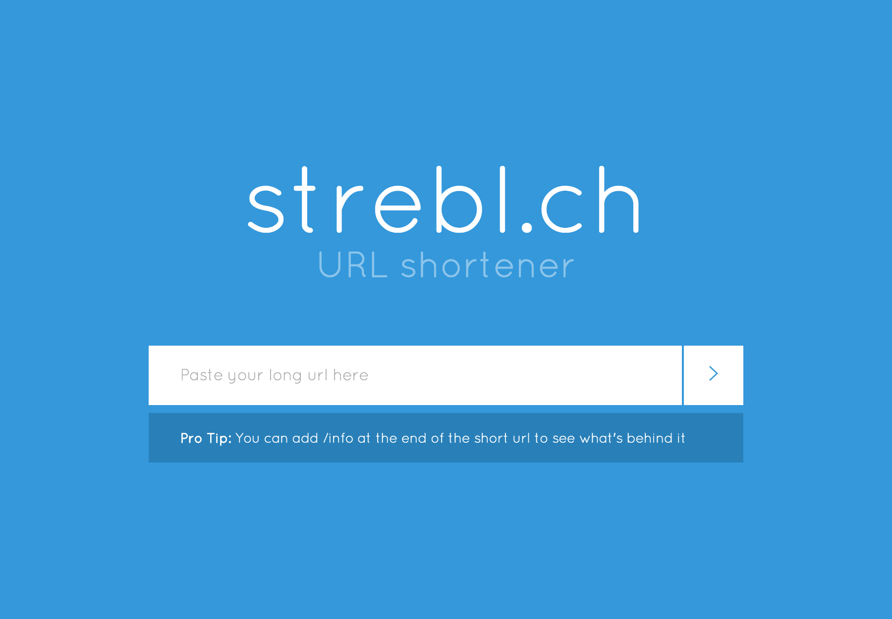

# strebl.ch URL shortener

My private url shortener

**Don't forget to add the Safe Browsing API key to the `.env` file**  
`SAFE_BROWSING_API_KEY=xxx`

**Example URL**
[https://strebl.ch/ybc](https://strebl.ch/ybc)

**Don't want to click on the link if you don't know what's behind it?**
No Problem: [https://strebl.ch/ybc/info](https://strebl.ch/ybc/info)

